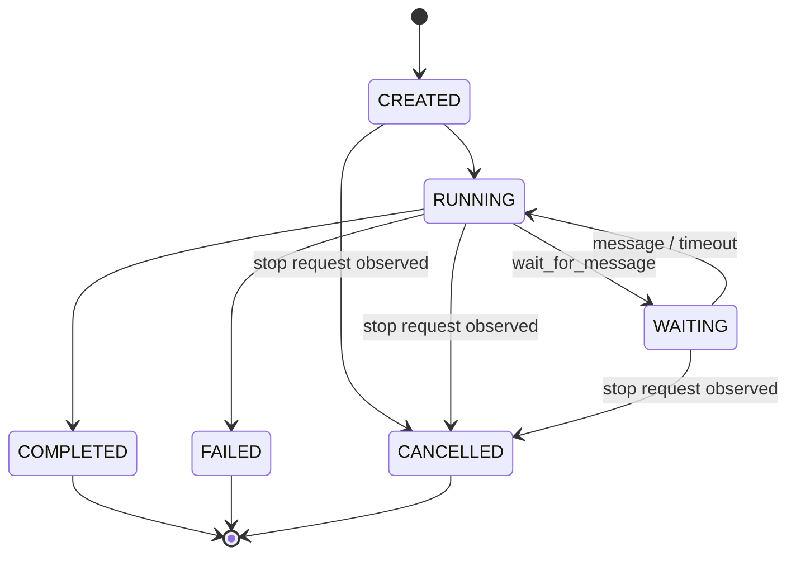

# SecMind Agent Graph 控制契约

状态：`implemented`
版本：`1.0`
日期：2026-07-20

本契约定义 Agent Graph 的创建、消息、等待、停止、状态转换和通信边界。它是现有 15-role
协作模型的增量控制面，不改变 Agent role、父子委派关系、独立 message chain、委派深度或并发
配置。

## 状态机



- `COMPLETED/FAILED/CANCELLED` 是终态，不会因新消息重新启动。
- `agent.stop_requested` 表示停止意图，实际终态由 Agent 在安全检查点写入
  `agent.cancelled`。
- 停止一个 Agent 会向下传播到它的子树，不向上传播给父 Agent。
- 停止子 Agent 后，父 Agent收到 `CANCELLED` 的 `AgentResult`，可继续、改派或完成。

## Create

- `AgentDispatcher.start_root` 后台启动根 Agent，在 `agent.created` 持久化后立即返回。
- GraphQL `createAgent` 创建根 Agent；未提供 `runId` 时由服务生成。
- GraphQL `delegateAgent` 创建一等 `AgentDelegation` 并后台启动子 Agent，立即返回
  delegation，不等待子任务完成。
- 原有 `dispatch_root/delegate_from` 保持阻塞语义，供现有运行时兼容使用。
- 子任务必须与父 Agent 具有相同 `run_id` 和 `flow_id`，不得跨运行委派。

## Message

- GraphQL `sendAgentMessage` 和 `AgentDispatcher.send_message` 发送公开结构化消息。
- 发送者与接收者必须属于同一 `run_id` 和 `flow_id`，且不能是同一实例。
- 消息写入 `agent_messages`、`agent.message` Ledger 事件和接收者独立 message chain。
- 消息按 `run_id + sequence` 严格排序。
- 终态 Agent 不接受新消息，避免破坏已持久化的 `AgentResult`。
- 原始 Evidence 通过 `evidence_ids` 或 `payload_ref` 引用，不复制或改写证据内容。

## Wait

存在两个不同的等待语义：

1. `AgentRunContext.wait_for_message` 是 Agent 内部协作等待。它将状态设为 `WAITING`，收到
   消息、超时或停止请求后恢复。
2. GraphQL `waitAgent` 是操作员长轮询。它等待 Agent 进入终态或达到超时，不改变 Agent
   的执行状态。

`waitAgent.timeoutSeconds` 范围为 0 到 600 秒。超时后返回当前 `AgentInstance`，调用方通过
`status` 判断是否仍在执行。

## Stop

- GraphQL `stopAgent` 和 `AgentDispatcher.stop_agent` 创建协作式停止请求。
- 每个 `agent.stop_requested` 前必须存在同一 `decision_id/correlation_id` 的
  `decision.recorded`。
- 等待中的 Agent 会立即被唤醒；模型或工具调用中的 Agent 在下一安全检查点停止。
- API 不使用向上级传播的 task cancellation，因此停止子 Agent 不会误停父 Agent。
- 对终态 Agent 重复停止是幂等操作。

## GraphQL

```graphql
createAgent(input: CreateAgentInput!): AgentInstance!
delegateAgent(input: DelegateAgentInput!): AgentDelegation!
sendAgentMessage(input: SendAgentMessageInput!): AgentMessage!
waitAgent(agentInstanceId: ID!, timeoutSeconds: Int! = 30): AgentInstance!
stopAgent(agentInstanceId: ID!, reason: String! = "Operator requested stop"): AgentInstance!
```

Graph 查询继续使用 `agentInstances/agentDelegations/agentMessages`。实时状态通过已有
`agentStarted/agentDelegated/agentMessageAdded/agentCompleted/agentFailed` 和统一
`runtimeEventAdded` subscription 投影。

## 事件

- 生命周期：`agent.created/started/waiting/resumed/completed/failed/cancelled`
- 控制：`agent.stop_requested`
- 通信：`agent.delegated/agent.message`
- 公开原因：`decision.recorded`

受控 `agent.delegated/agent.completed/agent.stop_requested` 必须引用此前的公开决策。消息本身
不是工具调用，Agent 委派也不得投影为 synthetic tool call。

## 当前恢复边界

数据库与 Ledger 持久化 Agent 图、消息和状态；进程内 inbox 与后台 coroutine 不跨进程恢复。
应用重启后可审计和查询既有图，但不能向重启前的 coroutine 发送消息或停止它。原生 Agent
执行恢复需要后续将 dispatcher 活跃任务接入 checkpoint/recovery coordinator，不能通过伪造
RUNNING 状态实现。
