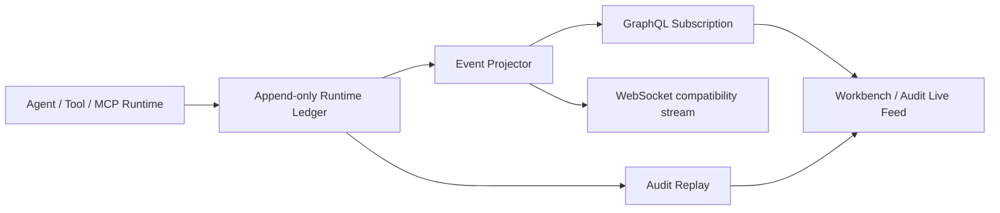

# SecMind 运行事件与公开决策契约

状态：`frozen`
契约版本：`EventEnvelope 1.1`
生效日期：2026-07-19

本文档是实时事件后端、Live Feed、Agent Graph、统一工具网关、独立验证器和长期任务
状态等并行工作的共同边界。字段名、枚举、事件名和 Schema 保持英文；面向用户的说明文字使用
简体中文。

## 1. 架构边界



- `runtime_ledger_events` 是运行事实的唯一事件源。
- GraphQL、WebSocket 和前端不得创建另一套事件含义，只能投影 `EventEnvelope`。
- `projection_*` 是可重建读模型，不是事实源。
- LangGraph checkpoint 只负责恢复执行，不承担审计事实。
- 原始工具输出进入 payload、Artifact 或 Evidence 后不得翻译或改写。展示层可以额外生成中文摘要。
- 系统不存储或展示 private chain-of-thought。操作原因使用公开、有限、可引用证据的
  `DecisionRecord.rationale_summary`。

## 2. EventEnvelope 1.1

Pydantic 权威模型：`secmind/backend/app/schemas/runtime.py::EventEnvelope`。

| 字段 | 类型 | 规则 |
| --- | --- | --- |
| `schema_version` | `String` | 新事件固定为 `1.1`；旧事件保留 `1.0` |
| `event_id` | `ID` | 全局唯一 |
| `run_id` | `ID` | 一个执行实例的顺序边界 |
| `sequence` | `Int` | 在同一 `run_id` 内严格递增，从 1 开始 |
| `event_type` | `String` | 使用 `RuntimeEventType`；扩展事件仍可回放 |
| `category` | `EventCategory` | 由 `event_type` 前缀确定，不由生产者自由填写 |
| `timestamp` | `DateTime` | UTC；不作为排序依据 |
| `actor` | `String` | 公开执行主体，例如 Agent role、`tool_gateway` |
| `context` | `EventContext` | 操作关联信息，不放业务结果 |
| `payload` | `JSON` | 事件专属内容，原始证据保持原文 |
| `decision` | `DecisionRecord?` | 仅 `decision.recorded` 自动结构化投影 |
| `verification_verdict` | `VerificationVerdict?` | 验证事件的三态结果 |
| `prev_hash` / `hash` | `String` | Ledger 持久化和传输时必须存在 |

`EventContext` 字段：

| 字段 | 含义 |
| --- | --- |
| `flow_id` | UI 和业务数据所属 Flow |
| `correlation_id` | 一次逻辑操作的稳定标识；跨多个事件保持相同 |
| `causation_id` | 直接导致当前事件的上一个 `event_id` |
| `decision_id` | 授权当前受控动作的公开决策 |
| `agent_instance_id` | 实际执行 Agent，不仅是 role |
| `task_id` | 持久化任务标识 |
| `tool_invocation_id` | Native/MCP 共用的工具调用标识 |
| `visibility` | `public/operator/audit`；不得用它保存私有思维链 |

`correlation_id` 表示逻辑操作，`causation_id` 表示直接因果，两者不可互相替代。并发 Agent
产生的事件只保证各自 `run_id + sequence` 顺序，不要求相邻。

## 3. DecisionRecord

`DecisionRecord` 是面向操作员的科学化决策摘要，不是模型草稿。权威字段如下：

| 字段 | 要求 |
| --- | --- |
| `decision_id` | UUID；动作事件通过 `context.decision_id` 引用 |
| `kind` | `route/plan/delegate/tool/wait/stop/verify/retry/complete/fallback/other` |
| `goal` | 当前动作试图解决的具体问题 |
| `decision` | 已选择的动作 |
| `rationale_summary` | 简体中文；说明证据如何支持选择，不记录隐含推理过程 |
| `evidence_ids` | 支持该选择的 Evidence；没有证据时为空并明确说明假设 |
| `alternatives` | 未选方案、未选原因及相关 Evidence |
| `expected_outcome` | 执行前可检验的预期结果 |
| `risk_summary` | 范围、影响和失败方式的简要说明 |
| `actual_outcome` | 执行后观察到的结果；不得把推断写成事实 |
| `next_action` | 基于结果的下一步公开动作 |
| `policy_ids` | 实际参与决策的策略标识 |
| `confidence` | `[0, 1]`；表示结论置信度，不表示风险等级 |
| `model_id` / `prompt_version` | 可复现性信息 |
| `created_at` | UTC 创建时间 |

事实、推断和假设必须分开表达。`rationale_summary` 不得包含隐藏 system prompt、模型
scratchpad、密钥、完整认证头或未经脱敏的个人信息。

## 4. 事件顺序不变量

### 4.1 决策先于受控动作

以下事件必须引用一个更早的 `decision.recorded`：

- `agent.delegated`
- `agent.stop_requested`
- `agent.completed`
- `tool.started`
- `run.completed`

两者必须具有相同 `run_id`、`correlation_id` 和 `decision_id`。允许其他并发事件出现在两者
之间，因此不得用“前一条事件”代替显式引用。

### 4.2 工具调用闭合

每个 `tool.started` 必须按相同 `tool_invocation_id` 结束于且只结束于以下一种状态：

- `tool.completed`
- `tool.failed`
- `tool.timed_out`
- `tool.cancelled`
- `tool.blocked`

MCP 的 `mcp.call_*` 是协议级遥测；面向 Agent 和 UI 的生命周期仍必须投影为统一
`tool.*` 事件。工具异常应转换为模型可见的结构化失败结果，不得仅抛出异常并中断事件流。

### 4.3 验证三态

独立验证器输出只允许：

- `confirmed`：独立复现成功，并且负向/基线对照支持原结论。
- `rejected`：存在可引用反证，足以否定原结论。
- `inconclusive`：无法确认且证据不足以否定。

“未复现”本身不能写成 `rejected`。`verification.completed` 必须包含 `verdict`、
`evidence_ids`、复现方法摘要和限制条件。

## 5. 事件词汇

除现有 `run/flow/task/input/plan/agent/tool/mcp/evidence/report` 事件外，1.1 冻结以下能力事件：

- 公开决策：`decision.recorded`
- Agent 控制：`agent.waiting`、`agent.resumed`、`agent.stop_requested`
- 工具终态：`tool.timed_out`、`tool.blocked`
- 独立验证：`verification.started`、`verification.completed`
- 长期任务：`skill.registered|updated|loaded|unloaded`、
  `todo.created|updated|completed`、`note.recorded|archived`
- 上下文压缩：`context.compressed`
- 防循环：`loop.detected`、`strategy.changed`
- 熔断器：`circuit.opened|half_opened|closed`

这些事件提供原生能力的可观察性，不是功能开关，也不限制 Agent 或 MCP 的默认可用范围。

## 6. GraphQL 契约

冻结 SDL：`secmind/backend/app/graphql/schema.graphql`。

`RuntimeEvent` 在原字段基础上新增：

- `schemaVersion`、`category`、`visibility`
- `flowId`、`correlationId`、`causationId`
- `decisionId`、`agentInstanceId`、`taskId`、`toolInvocationId`
- `decision`、`verificationVerdict`

Query 和 Subscription 继续使用相同 DTO：

```graphql
runtimeEvents(runId: ID!, afterSequence: Int = 0): [RuntimeEvent!]!
runtimeEventAdded(runId: ID!, afterSequence: Int = 0): RuntimeEvent!
```

重连后以最后确认的 `sequence` 作为 `afterSequence`。客户端按 `eventId` 去重，并按
`sequence` 应用，不按到达时间排序。

## 7. 数据库契约

Alembic revision `20260719_0003` 只向 `runtime_ledger_events` 增加可选关联字段：

`schema_version`、`flow_id`、`correlation_id`、`causation_id`、`decision_id`、
`agent_instance_id`、`task_id`、`tool_invocation_id`、`visibility`。

- 迁移前事件标记为 `schema_version=1.0`，其旧哈希算法保持有效。
- 新事件标记为 `1.1`，哈希覆盖核心字段、payload 和完整 `EventContext`。
- 不回填推测性的关联信息；未知值保持 `NULL`。
- 原 Ledger 永不因上下文压缩、前端投影或验证结论变化而修改。
- Live Feed 所需索引覆盖 `flow_id`、`correlation_id`、`decision_id`、
  `agent_instance_id`、`tool_invocation_id`。

当前不创建独立 `decision_records` 事实表。`decision.recorded` 是事实；后续 Event Projector
可以增加可重建的 `projection_decisions`，但不得成为写入入口。

## 8. 版本与兼容性

- `1.x` 只能增加可选字段、事件名或枚举值。
- 删除字段、改变字段含义、改变顺序键或复用事件名必须升级 major version。
- 未识别事件必须作为 `category=system` 保留并展示原 payload，不能静默丢弃。
- WebSocket 继续在 `server.ledger_entry` 内承载该事件，直到所有前端切换 GraphQL。

## 9. 并行工作验收

每个后续实现对话必须满足：

1. 只生产本契约中的公共字段，不创建平行 DTO。
2. 为其新增事件提供至少一个生成测试和一个回放/投影测试。
3. 保留 `run_id + sequence` 顺序及 `event_id` 幂等性。
4. 受控动作通过 `decision_id` 关联公开原因。
5. 原始工具证据不翻译、不篡改，所有展示摘要可追溯到 Evidence。
6. 失败、超时、取消和阻止都产生明确终态事件。

## 10. 实时流实现

权威实现：`secmind/backend/app/services/event_stream.py::RuntimeEventStream`。

- Hub 只发送容量为 1 的合并唤醒信号，不承载事实事件。
- 消费者先注册唤醒订阅，再按 `run_id + after_sequence` 查询 Ledger，消除回放/订阅窗口。
- 队列满时合并通知；消费者恢复后从 Ledger 读取全部缺失事件。
- 即使生产者提交事件后未成功发送通知，周期性恢复查询仍会交付该事件。
- GraphQL `runtimeEventAdded`、`/api/v1/runs/{run_id}/events` 和 legacy Flow WebSocket
  共享这一持久流。
- legacy Flow WebSocket 继续使用 `server.ledger_entry`，但 runtime 事件会在 LangGraph
  执行期间实时镜像，并在 `server.done` 或中断前按游标补齐。
