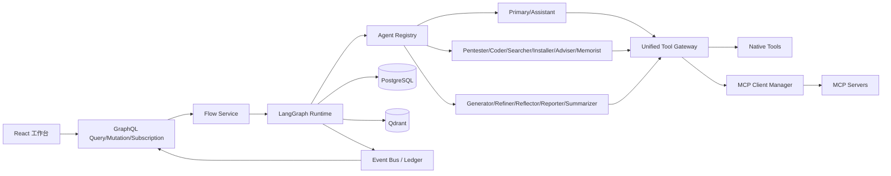

# PentAGI 核心能力原生移植计划

## 1. 移植目标

将 PentAGI 的任务分层、Prompt、智能体协作、工具系统、MCP、消息链、审计、GraphQL 和前端工作台作为 SecMind 的原生能力实现。目标不是在现有单图运行时外增加兼容插件，而是形成统一的数据模型、调用协议和运行内核。



## 2. 原生能力原则

- 多智能体不是前端状态映射，而是独立 Agent 实例、消息、委派、模型和执行上下文。
- MCP 不是外围适配器。MCP Tools、Resources 和 Prompts 与本地工具共同进入统一注册表。
- 所有 Agent 默认可以发现并调用已连接 MCP Server 提供的能力；按角色限制作为可选配置，不作为系统默认前提。
- Agent 可以直接委派其他 Agent，支持串行、并行、重试、反思和动态重规划。
- 保留必要工程边界：身份认证、密钥不外泄、参数 Schema 校验、超时取消、工作目录隔离和完整审计。
- PostgreSQL 保存业务事实，LangGraph Checkpoint 保存恢复状态，Qdrant 保存向量知识，三者职责分离。
- GraphQL 是前端主要业务 API；现有 REST 可保留到前端迁移完成后再下线。

## 3. Prompt 验证与移植

PentAGI 当前包含 39 个运行 Prompt 和 2 个 Graphiti 记忆模板。Prompt 工作簿是后续修改与导入的唯一交换格式。

当前阶段不修改原始 Prompt。先由 Prompt 评测负责人完成语法基线、行为可行性、科学性和多模型一致性测试；只有候选修订在成对 A/B 测试中优于基线，才进入版本表并由用户确认启用。详细标准见 `docs/prompt-validation-plan.md`。

未来需要修改时的处理流程：

1. 按 `Prompt键` 读取“修改后Prompt”列。
2. 对比原文，生成修改差异报告。
3. 校验模板变量没有意外丢失或改名。
4. 将 Go Template 变量转换为 SecMind 的 Jinja2 模板变量。
5. 对 `if`、`range`、嵌套对象和工具名变量执行转换测试。
6. 使用固定测试上下文渲染全部 Prompt，禁止出现未解析变量。
7. 运行基线版与候选版的成对评测，记录完成率、证据准确率、工具调用成功率、Token 和耗时。
8. 写入 `prompts` 和 `prompt_versions`，保留原始版、候选版、评测报告、版本号和启用状态。
9. Agent Registry 从数据库加载用户确认启用的版本，支持运行时刷新。

目标目录：

```text
secmind/backend/prompts/native/
secmind/backend/prompts/graphiti/
secmind/backend/prompts/renderer.py
secmind/backend/prompts/registry.py
secmind/backend/prompts/importer.py
```

## 4. 数据库设计

新增或完善以下 PostgreSQL 表：

| 领域 | 表 | 主要内容 |
| --- | --- | --- |
| 用户权限 | `users`, `roles`, `privileges` | 用户、角色和 GraphQL 权限 |
| 工作流 | `flows`, `tasks`, `subtasks` | Flow -> Task -> Subtask 分层状态 |
| Agent | `agent_instances`, `agent_delegations`, `agent_messages` | Agent 实例、上下游委派和结构化消息 |
| Prompt | `prompts`, `prompt_versions` | Prompt 键、角色、模板、版本和启用状态 |
| 消息链 | `message_chains`, `message_entries` | 模型对话历史、摘要和上下文 |
| 工具 | `tool_calls` | 本地和 MCP 工具参数、结果、状态、耗时 |
| MCP | `mcp_servers`, `mcp_capabilities` | Server 连接信息及发现的 Tools/Resources/Prompts |
| 运行控制 | `approvals`, `runtime_runs`, `runtime_events` | 审批、AgentState 快照和不可变事件 |
| 结果 | `artifacts`, `evidence`, `findings`, `reports` | 文件、证据、发现和报告 |
| 模型统计 | `llm_calls`, `llm_usage` | Agent、模型、Token、费用和耗时 |
| 查询投影 | `projection_*` | 面向 GraphQL 列表和统计的可重建视图 |

`flows` 必须替换当前内存 `FlowStore`。所有 Agent、MCP 和工具记录关联 `flow_id`，需要时再关联 `task_id`、`subtask_id` 和 `agent_instance_id`。

MCP 密钥不存储明文，只保存 Secret 引用或环境变量键名。MCP 能力发现结果可以持久化，并在 Server 重连后更新。

## 5. GraphQL 原生 API

在 FastAPI 中集成 Strawberry GraphQL，提供 `/graphql` HTTP 和 WebSocket Subscription。

### Query

- `flows`, `flow`, `tasks`, `subtasks`
- `agentInstances`, `agentDelegations`, `agentMessages`
- `toolCalls`, `mcpServers`, `mcpCapabilities`
- `messageChains`, `runtimeEvents`, `approvals`
- `artifacts`, `evidence`, `findings`, `report`
- `prompts`, `promptVersions`
- `usageByFlow`, `usageByAgent`, `usageByModel`, `usageByTool`

### Mutation

- `createFlow`, `submitFlowInput`, `stopFlow`, `finishFlow`, `deleteFlow`, `renameFlow`
- `createAssistant`, `callAssistant`, `stopAssistant`
- `registerMCPServer`, `updateMCPServer`, `removeMCPServer`, `refreshMCPCapabilities`
- `enablePromptVersion`, `createPromptVersion`, `importPrompts`
- `approveAction`, `rejectAction`
- `retrySubtask`, `revisePlan`, `delegateAgent`

### Subscription

- `flowUpdated`, `taskUpdated`, `subtaskUpdated`
- `agentStarted`, `agentDelegated`, `agentMessageAdded`, `agentCompleted`, `agentFailed`
- `toolCallStarted`, `toolCallUpdated`
- `mcpServerUpdated`, `mcpCapabilityUpdated`
- `approvalRequested`, `runtimeEventAdded`, `reportUpdated`

GraphQL Resolver 只调用 Service，不直接包含 Agent 或 MCP 业务逻辑。Subscription 从统一事件总线读取，并按 `run_id + sequence` 保证顺序和重连补放。

## 6. MCP 原生工具系统

目标目录：

```text
secmind/backend/mcp/transports.py
secmind/backend/mcp/client.py
secmind/backend/mcp/manager.py
secmind/backend/mcp/registry.py
secmind/backend/mcp/models.py
secmind/backend/tools/gateway.py
```

实现内容：

1. 支持 stdio、Streamable HTTP 和 SSE Transport。
2. 启动时连接已启用 Server，完成 initialize 和 capability negotiation。
3. 原生读取 `tools/list`、`resources/list` 和 `prompts/list`。
4. 将 MCP Tool 与本地 `RuntimeTool` 注册到同一个 Tool Registry。
5. Agent 使用统一名称和 Schema 调用，不区分底层是本地还是 MCP。
6. MCP Resource 可直接加入 AgentContext，MCP Prompt 可进入 Prompt Registry。
7. 支持 Server 热添加、移除、重连和能力刷新。
8. MCP 调用结果统一转换为 ToolResult、Artifact、Evidence 和账本事件。
9. 所有调用支持流式进度、取消、超时和错误回传。

## 7. 多智能体内核

原生角色包括：

```text
primary_agent, assistant, generator, refiner, adviser, reflector,
searcher, enricher, coder, installer, pentester, memorist,
reporter, summarizer, toolcall_fixer
```

统一接口：

```python
class Agent:
    descriptor: AgentDescriptor
    prompt_key: str
    model_profile: str

    async def run(self, task: AgentTask, context: AgentContext) -> AgentResult: ...
    async def delegate(self, role: str, task: AgentTask) -> AgentResult: ...
```

每个 Agent 都拥有独立消息链、Prompt、模型配置、工具上下文和运行记录。Agent Registry 负责构造与发现；Agent Dispatcher 负责委派、并行执行和结果回收。

委派不是模拟工具消息。数据库必须写入 `agent_delegations`，事件总线发布 `agent.delegated`，前端显示真实的发起 Agent、执行 Agent、任务和结果。

## 8. LangGraph 工作流

主图：

```text
ingest
  -> classify
  -> generate_plan
  -> validate_plan
  -> dispatch_subtasks
  -> specialist_agent_subgraph
  -> collect_results
  -> verify
  -> refine_or_continue
  -> report
  -> memory_commit
```

每个专家 Agent 使用可复用子图：

```text
load_context -> reason_and_select -> call_agent/call_tool -> observe
             -> reflect_if_needed -> return_result
```

Generator 创建初始 Subtask；Refiner 在每个 Subtask 后可以增删改剩余计划；Reflector 纠正无工具调用、参数错误或结构异常；Reporter 汇总所有已验证结果；Memorist 将完成经验写入 Qdrant。

无依赖 Subtask 允许并行。并行度、最大循环和 Token 预算是运行配置，不绑定固定角色限制。

## 9. 事件与持久化

关键事件：

```text
flow.*, task.*, subtask.*
agent.created, agent.started, agent.delegated, agent.message,
agent.completed, agent.failed
plan.created, plan.revised
tool.started, tool.completed, tool.failed
mcp.connected, mcp.capabilities_updated
approval.requested, approval.resolved
evidence.recorded, finding.recorded, report.generated
```

PostgreSQL 业务表是可查询事实；`runtime_events` 保留不可变顺序事件；LangGraph Checkpoint 用于中断恢复。进程重启后恢复 Agent、消息链、计划和未完成工具状态。

## 10. 前端改造

1. Apollo Client 替换主要 REST 数据读取。
2. GraphQL Subscription 驱动 Flow、Agent、工具和审批实时更新。
3. 协作网络从固定五角色改为按 `agent_instances` 动态生成。
4. 节点显示 Agent 角色、实例、当前 Subtask、模型和状态。
5. 连线显示真实 `agent_delegations` 和 `agent_messages`。
6. 工具面板统一显示本地与 MCP 工具，不在主要交互上区分等级。
7. 新增 MCP Server 与能力管理页。
8. 新增 Prompt 版本查看、切换和差异页。
9. 审计页支持按 Flow、Task、Subtask、Agent、工具和事件筛选。

## 11. 实施顺序

### 阶段 A：数据与 Prompt

- PostgreSQL 业务表和 Alembic 迁移。
- 持久化 Flow/Task/Subtask。
- Prompt Registry、Jinja2 Renderer、版本表和工作簿导入器。

### 阶段 B：GraphQL

- Query/Mutation/Subscription Schema。
- Service/Resolver 分层、认证上下文和事件补放。
- 前端 Apollo 基础接入。

### 阶段 C：MCP

- MCP Client Manager、三类 Transport 和能力注册。
- Tools、Resources、Prompts 全量接入统一 Registry。
- MCP 管理 GraphQL 与前端页面。

### 阶段 D：Agent 内核

- Agent 基类、Registry、Dispatcher 和独立消息链。
- 15 类原生 Agent 及 Prompt 绑定。
- Agent 委派、并行执行和事件发布。

### 阶段 E：完整编排

- Flow/Task/Subtask 主图和 Agent 子图。
- Generator、Refiner、Reflector、Reporter、Memorist 闭环。
- Checkpoint 恢复和运行重入。

### 阶段 F：前端与审计

- 动态协作网络、真实委派连线、MCP 工具面板。
- Prompt 管理、模型用量和完整审计回放。

## 12. 测试与验收

- 41 个 Prompt 全部能够使用测试上下文成功渲染。
- GraphQL Query、Mutation、Subscription 通过契约测试。
- 本地工具和 MCP 工具可由同一 Agent 在同一任务内调用。
- Primary Agent 可以委派多个专家，并行回收结果。
- Refiner 能修改未执行计划，Reflector 能修复异常调用。
- 重启后能够恢复 Flow、Agent、消息链和执行位置。
- 前端显示的 Agent 节点、连线、工具和状态与数据库事实一致。
- 任一报告可追溯到 Subtask、Agent、工具调用和证据。
- 密钥不出现在模型上下文、GraphQL 响应和审计事件中。
